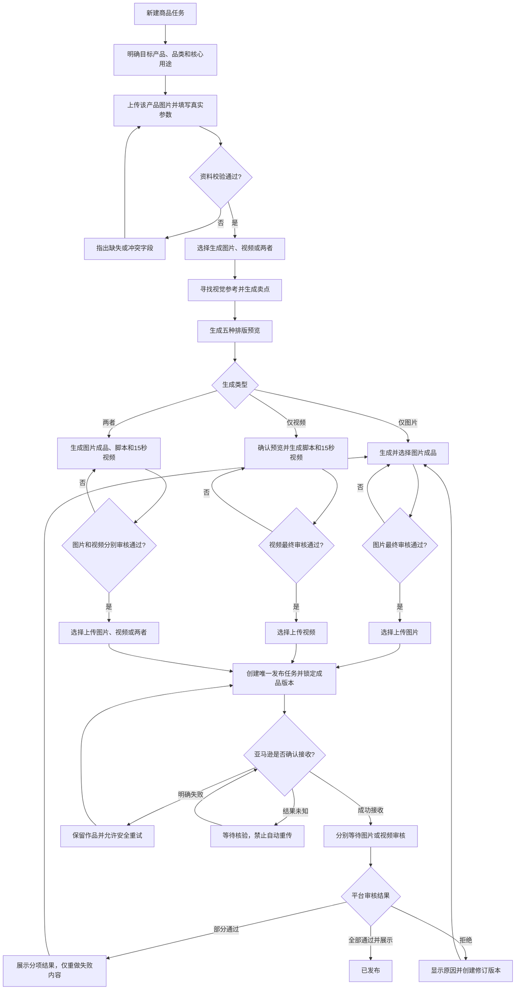

# 跨境电商商品图片与视频生成工具

## 1. 产品定位

面向中小型 Amazon US 跨境电商卖家的 Web MVP。用户输入真实商品资料，系统通过一个 Creative Agent 生成结构化创意方案，并调用图片/视频模型生成详情页素材。商品事实是唯一事实源，AI 不得编造卖点。

## 2. 核心价值

相比直接问通用 AI，本产品价值不在“写提示词”，而在稳定流程：固定输入、事实校验、结构化 JSON、人工审批、图片/视频生成、Amazon 模拟预览。它减少重复写 Prompt 和误用未验证卖点的风险。

## 3. 用户与场景

核心用户：缺少设计和英文营销能力的 Amazon 卖家、运营人员。

典型场景：

- 新品上架前，生成主图建议、三张副图和短视频。
- 老品改版时，修改受众或卖点后重生成。
- 面对“保温 24 小时”等声明时，系统要求事实依据。

市场规模、付费意愿、节省时间、转化提升均为待验证假设。

## 4. MVP 流程

Product Input → Creative Brief → Approval → Images → Storyboard → Video → Amazon Mock Preview。

异常规则：

- 必填信息缺失：不调用模型，提示补充。
- JSON 不合法：自动重试一次，仍失败则提示用户重试。
- 图片或视频失败：保留已成功结果，允许单项重试或使用预生成兜底素材。
- 修改商品事实：相关结果需重新审核。

## 5. 核心功能

1. 商品输入

支持示例商品“保温随行杯”与可编辑输入。字段包括商品名、品类、品牌、站点、参考图、商品事实、禁止声明、目标受众。每条事实有 `fact_id` 和验证状态。

2. Creative Agent

基于商品事实输出 JSON：受众、主题、主图建议、三张副图规划、英文文案、引用事实、图片 Prompt、视频 storyboard、缺失信息、被拦截声明。Agent 只能输出 `pending`。

3. 图片生成

生成三张副图：核心卖点图、使用场景图、规格信息图。每张图可单独重试。V1 可使用真实模型，并保留预生成结果兜底。

4. 视频生成

用户批准图片和 storyboard 后生成 6-10 秒短视频。视频成本更高，须在图片确认后触发，并展示预计 Credits。

5. Amazon 模拟预览

展示主图建议、副图、视频和英文文案，标注“仅为 Demo Preview，未发布到 Amazon”。

## 6. 技术方案

Frontend → FastAPI → `AdGenerationWorkflow.generate()` → Provider → Model API。

V1 只保留 `workflow/ad_generation.py`。Provider 是薄适配层，可切换 DeepSeek、Seedream、Seedance 或 Demo Provider。不拆多个 Agent，不做复杂状态机。

## 7. 不做范围

V1 不做登录、支付、数据库、团队权限、真实 Amazon 发布、完整 Listing、数据分析、自动优化循环、Critic Agent、模板社区、多站点和批量商品。

## 8. 验收标准

- 示例商品可一键跑完整 Demo。
- 用户可编辑输入并重新生成结果。
- AI 输出必须通过 JSON Schema。
- 最终文案引用的事实必须来自用户输入。
- 未验证或禁止声明不能进入最终素材。
- 图片/视频失败时不影响已完成内容。
- README 说明启动方式、Demo 流程、模型配置和 V1 边界。

## 9. 待验证假设

- Amazon 卖家愿意为“更稳定的生成流程”付费。
- Subscription + Credits 适合该产品。
- 用户愿意多一步 Brief 审批来换取事实可控。
- 社媒展示 Demo 案例能带来冷启动线索。


##后续优化目标
## 1. 产品概述

### 1.1 一句话定位

这是一个给跨境电商卖家使用的内部 Web 工具。卖家在创建任务时先明确目标产品及其品类，再上传该产品的图片与真实参数，并选择生成营销图片、英文商品视频或两者。系统根据目标产品寻找同类视觉参考、提炼适合该产品的卖点并生成相应内容。卖家最终审核通过后，可以独立选择向亚马逊美国站指定 ASIN 上传图片、视频或两者。

### 1.2 核心价值

- 缩短查找视觉参考、写卖点、做图片和剪视频的时间。
- 用结构化商品参数约束生成内容，减少虚假或错误宣传。
- 先审预览、再生成视频，降低昂贵的视频返工。
- 对最终审核、提交和重试建立完整记录，避免误传和重复上传。

### 1.3 产品形态

- **当前选型**：桌面端 Web App。
- **选择理由**：图片、参数、脚本和视频需要在同一工作台中对照审核；内部使用无需应用商店分发。
- **阶段策略**：先支持内部单账号、单商品任务，但不预先固定商品品类。每次任务由卖家明确目标产品；验证流程稳定后再扩展账号和平台。

### 1.4 业务目标与初始指标

- 完整素材提交后，目标 1 分钟内给出卖点和脚本草稿。
- 目标 5 分钟内给出第一条可审核视频；该时间不包含人工审核及亚马逊处理时间，正式承诺需用真实服务验证。
- 单条最终视频的累计生成成本不超过 100 元人民币，包括参考分析、预览、配音、合成和任务内重试。
- 任何图片或视频未经最终审核不得提交；图片和视频分别审核、分别记录版本。
- 提交失败不得丢失作品，也不得产生重复上传。

## 2. 目标用户与使用场景

### 2.1 核心用户

亚马逊美国站跨境电商卖家，当前先服务工具拥有者本人。用户可处理不同品类的单个商品，拥有商品图片、真实参数、目标 ASIN 和相应的 Seller Central 内容上传权限，但缺少快速制作英文营销图片或视频的能力或时间。

### 2.2 核心痛点

- 找参考、提炼卖点、编写英文脚本和剪辑视频需要切换多个工具。
- 生成式工具容易改变产品外观，或编造容量、功率、兼容性等参数。
- 视频生成成本高，直接生成成片后再修改容易浪费时间和费用。
- 亚马逊提交结果存在处理中、审核拒绝等状态，简单的“上传成功”提示不足以反映真实发布状态。

### 2.3 典型场景

1. 卖家准备为某款商品制作营销内容，先填写产品名称、品类和核心用途，再上传该商品的图片与参数；系统据此生成同类视觉参考、卖点和五种预览，并按选择输出图片、约 15 秒视频或两者。
2. 卖家发现预览中的连接方式或产品比例不正确，只重做相关预览，不重新生成其余素材。
3. 卖家完成图片或视频的最终审核并提交到指定 ASIN；网络中断后，系统保留所有作品并先查询各子任务状态，避免再次上传已接收的内容。

## 3. MVP 范围

### 3.1 包含

- 不限预设品类的商品任务创建、目标产品声明和版本保存。
- 商品图片、真实参数、目标 ASIN 的录入与校验。
- 生成类型选择：仅图片、仅视频、图片和视频。
- 自动寻找并保存视觉参考的来源和借鉴理由。
- 基于真实参数生成英文卖点、英文脚本及中文释义。
- 五种排版关键帧预览：不规则式、聚焦式、斜切式、中心式、留白式。
- 预览选择、局部修改和单张重做。
- 约 15 秒图片动态视频生成，包含字幕和美式英语配音。
- 图片成品生成、选择、排序和版本管理。
- 上传类型选择：仅图片、仅视频、图片和视频；可上传类型受已生成且已审核的成品限制。
- 最终审核、确认提交、发布状态跟踪和安全重试。
- 单任务耗时、生成次数与累计成本记录。

### 3.2 暂不包含

- 自动选品、销量预测和竞品商业数据分析。
- TikTok 等其他平台发布。
- 付费广告账户及广告投放。
- 多租户、订阅、计费和团队权限。
- 连续真人动作类 AI 视频。
- 自动修改亚马逊标题、主图和详情页。

## 4. 核心用户动线



## 5. 功能清单

```text
跨境电商商品视频工具
├── 🔴 商品任务
│   ├── 上传原始商品图片
│   ├── 填写和确认真实参数
│   ├── 选择生成图片、视频或两者
│   └── 保存草稿与版本
├── 🔴 内容策划
│   ├── 自动寻找视觉参考
│   ├── 提炼有依据的卖点
│   └── 生成英文脚本与中文释义
├── 🔴 视觉预览
│   ├── 生成五种排版预览
│   ├── 选择、修改和单张重做
│   ├── 产品一致性人工检查
│   └── 生成可上传图片成品
├── 🔴 视频制作
│   ├── 图片动态效果
│   ├── 英文字幕与美式英语配音
│   └── 成片版本管理
├── 🔴 最终审核与发布
│   ├── 图片与视频分别审核
│   ├── 选择上传图片、视频或两者
│   ├── 唯一发布任务和幂等控制
│   ├── 提交状态核验
│   └── 失败保留、安全重试与审核结果
├── 🟡 任务成本与效率
│   ├── 分阶段耗时
│   ├── 生成次数
│   └── 累计成本与预算提醒
└── ⚪ 后续规划
    ├── 品类专用参数模板与生成策略
    ├── TikTok 发布
    ├── 多账号与团队协作
    └── 商品标题、主图和详情页优化
```

## 6. 关键页面布局线框图

```text
┌──────────────────────────────────────────────────────────────────────────┐
│ Logo / 任务名称              保存状态     累计成本 ¥xx / ¥100    用户   │
├─────────────┬───────────────────────────────────────┬────────────────────┤
│ 生成类型     │          图片 / 视频主预览区           │ 当前步骤设置        │
│ 商品资料     │                                       │ 生成：图片/视频/两者 │
│ 视觉参考     │                                       │ 卖点与脚本           │
│ 五种预览     │          ← 页面视觉重心                │ 排版与场景           │
│ 脚本         │                                       │ 字幕与配音           │
│ 视频         ├───────────────────────────────────────┤ 参数依据与风险提示    │
│ 最终审核     │ 缩略图 / 版本 / 播放进度 / 对比         │ 修改意见             │
│ 发布状态     │                                       │ 上传：图片/视频/两者 │
├─────────────┴───────────────────────────────────────┴────────────────────┤
│ 进度、耗时与错误信息                      [保存草稿] [生成/重做/下一步] │
└──────────────────────────────────────────────────────────────────────────┘

最终审核时右侧替换为图片与视频的分项审核清单；只有本次选中上传的内容全部通过后，才显示“确认提交到亚马逊”。
```

## 7. 核心功能详细需求

### 7.1 商品资料录入

**功能描述**：先让卖家明确本次任务的目标产品，再建立内容生成的事实来源。系统不得自行把商品识别成另一个品类，也不得把参考图中出现、但卖家未确认的参数写入卖点或脚本。

**必填内容**：任务名称、目标产品名称、商品品类、核心用途、目标市场、至少一张该产品的商品图，以及发布时使用的目标 ASIN。商品参数字段根据品类动态展示；卖家也可以补充自定义参数。所有用作卖点的参数必须被卖家标记为“已确认”。

**目标产品确认**：系统可以根据图片建议产品名称和品类，但必须由卖家确认。确认前不得查找参考、生成卖点或开始内容制作。卖家更换目标产品或品类后，旧的参考结果、卖点、预览和审核状态全部标记为过期，不能继续发布。

**交互要求**：上传后显示缩略图、分辨率和文件大小；支持删除、排序和指定主参考图。参数冲突时禁止进入生成步骤，并指出冲突字段。

**边界处理**：

- 图片为空：显示示例和“上传商品图片”。
- 图片模糊或无法看清产品结构：允许保存，但标记风险并要求补图。
- 文件过大或格式不支持：说明限制并给出压缩或转换建议。
- 网络中断：保留已完成上传和表单草稿。
- ASIN 格式错误：禁止进入发布阶段，不影响前期内容制作。

### 7.2 视觉参考与卖点生成

**功能描述**：自动寻找同类商品的视觉参考，分析构图、配色、场景、信息层级和卖点表达。不得直接复制他人的品牌标识、文案或受保护素材。

**输出内容**：每个参考项包含缩略图、来源链接、获取时间、参考理由和可借鉴元素。系统同时给出 3 个以内的卖点候选，并为每个卖点标注商品参数或卖家确认信息的依据。

**卖点生成原则**：卖点必须根据当前任务明确的目标产品、核心用途和已确认参数生成。此前讨论的充电宝及“边充边拍”只作为流程示例，不属于产品默认品类或默认卖点。

**异常处理**：自动查找失败时，允许卖家上传参考图或跳过。来源无法确认的图片仅用于内部构图分析，不得直接进入成片。

### 7.3 五种排版预览

**功能描述**：围绕同一核心卖点生成五张低成本关键帧，分别使用不规则式、聚焦式、斜切式、中心式和留白式排版。

**交互要求**：五张图并列比较；点击放大；选择一张作为视频方向；可修改文案、背景、场景和产品位置；可单独重做某一张。每次重做前显示预计成本。

**一致性要求**：产品颜色、接口位置、线材数量和品牌标识应与原图一致；场景图不得暗示未经确认的功能。AI 无法可靠还原时，预览必须显示风险标签并要求人工确认。

**图片成品**：当生成类型包含图片时，卖家可以从五种预览中选择一张或多张生成高清成品。每张成品独立保存版本、用途和排序；用途至少包括主图候选、辅图和详情场景图。主图候选必须单独进行平台规则检查，不得因视觉效果好而自动设为主图。

### 7.4 脚本、字幕和视频合成

**功能描述**：当生成类型包含视频时，根据确认的卖点和选中预览生成约 15 秒视频。默认结构为痛点或场景引入、产品使用方式、核心卖点定格。选择“仅图片”时，本模块不执行，也不产生视频费用。

**内容要求**：英文脚本配中文释义；英文字幕与配音文本保持一致；字幕在静音状态下也能完整表达卖点；避免无法证明的比较级、最高级和性能承诺。

**编辑能力**：逐段修改文案、时长、画面、转场、字幕和配音；修改后生成新版本，旧版本可查看和恢复。仅修改字幕时，不重新生成图片。

**失败处理**：某个生成步骤失败时保留此前产物并从失败步骤重试。超出 100 元预算前必须暂停并显示原因，不得自动继续扣费。

### 7.5 最终审核

**功能描述**：建立独立于普通预览的发布前硬门槛。生成完成不等于审核通过。图片与视频是两个独立审核对象：上传图片需要图片审核通过，上传视频需要视频审核通过，上传两者则两项都必须通过。

**审核清单**：

- 产品外观、颜色、接口、线材和使用方式正确。
- 容量、功率、兼容性等参数与确认资料一致。
- 英文字幕、配音、拼写和中文释义一致。
- 视频标题、视频类型、语言、品牌及目标 ASIN 已确认。
- 已选定唯一成片版本和缩略图。
- 已选定要上传的图片版本、用途与排序，并逐张确认外观、文字和参数。
- 已选择上传类型，且所选类型存在已审核通过的成品。
- 卖家已确认内容可提交到亚马逊。

所有相关项目勾选后，卖家仍需点击一次“确认提交到亚马逊”。点击时弹窗展示 ASIN、上传类型、图片清单及排序、视频版本、标题和不可在处理中重复提交的说明。审核记录保存审核人、时间、内容类型、内容版本和资料快照；某类内容一旦修改，仅该类内容的审核自动失效。

### 7.6 发布、状态核验与防重复

**功能描述**：把经过最终审核的固定图片版本、视频版本或两者提交到目标 ASIN，并持续区分本地任务状态与亚马逊状态。生成类型与上传类型相互独立，例如可以生成图片和视频，但本次只上传视频。

**幂等规则**：图片提交按“账号 + ASIN + 图片文件哈希集合 + 图片审核版本”生成幂等键；视频提交按“账号 + ASIN + 视频文件哈希 + 视频审核版本”生成幂等键。上传两者时创建一个父任务和两个可独立重试的子任务。首次点击后立即锁定按钮；同一幂等键只能存在一个有效任务。

**状态定义**：

- `READY_FOR_REVIEW`：所选图片或视频成品完成，尚未最终审核。
- `APPROVED`：最终审核完成，尚未提交。
- `SUBMITTING`：请求已发出，结果尚未返回。
- `RECEIVED`：亚马逊确认接收，等待审核。
- `UNKNOWN`：请求结果不确定，等待核验，禁止自动重传。
- `FAILED_RETRYABLE`：确认未被接收，可以安全重试。
- `REJECTED`：亚马逊审核拒绝，显示原因并允许创建修订版本。
- `PUBLISHED`：亚马逊审核通过并确认已展示。

**重试规则**：失败时保留全部商品资料、参考素材、图片成品、预览、脚本、配音、视频、审核记录和发布日志。图片或视频仅一项失败时，不重复提交已成功的另一项。重试前先查询对应子任务状态；只有确认未接收或明确可安全重试时才发送。无法查询时保持 `UNKNOWN`，由卖家人工核验，不能自动创建第二个上传任务。

**技术验证项**：第一版开发前必须确认目标卖家账号可使用的官方接口、授权范围、视频上传方式和状态查询能力。如果没有满足要求的官方自动化接口，MVP 将发布步骤降级为“生成合规文件与提交资料包，并在 Seller Central 中由卖家完成上传”；不得用脆弱的页面自动化冒充稳定接口。

## 8. 关键数据规范

| 字段 | 类型 | 必填 | 规则 |
|---|---|---:|---|
| task_id | UUID | 是 | 创建任务时生成且不可变 |
| task_name | 字符串 | 是 | 1–80 字符 |
| marketplace | 枚举 | 是 | MVP 固定 `Amazon US` |
| target_product_name | 字符串 | 是 | 卖家明确填写；2–100 字符 |
| category | 字符串/受控选项 | 是 | 卖家选择或自定义，系统建议结果须经确认 |
| core_use_case | 字符串 | 是 | 说明产品解决的问题和主要使用场景，10–500 字符 |
| generation_mode | 枚举 | 是 | `IMAGE`、`VIDEO`、`BOTH` |
| upload_mode | 枚举 | 发布时是 | `IMAGE`、`VIDEO`、`BOTH`；只能选择已生成且审核通过的类型 |
| asin | 字符串 | 发布时是 | 10 位 ASIN，提交前再次校验 |
| product_images | 文件数组 | 是 | 至少 1 张；允许格式及大小待技术验证 |
| product_specs | 键值对象 | 是 | 按品类动态生成，也允许自定义；宣传字段必须带 `confirmed=true` |
| reference_items | 对象数组 | 否 | 保存来源、时间、缩略图和分析摘要 |
| selected_layout | 枚举 | 生成视频前是 | 五种排版之一 |
| image_assets | 对象数组 | 生成图片时是 | 文件、哈希、版本、用途、排序、审核状态 |
| script_version | 整数 | 是 | 每次修改递增 |
| video_version | 整数 | 是 | 每次重新合成递增 |
| video_hash | 字符串 | 上传视频时是 | 用于锁定内容与防重复 |
| approval_records | 对象数组 | 发布时是 | 按图片/视频保存审核人、时间、版本和资料快照 |
| publish_idempotency_keys | 对象 | 发布时是 | 图片与视频分别生成；同一内容与目标只能有一个有效任务 |
| publish_status | 枚举 | 是 | 使用 7.6 的状态集合 |
| accumulated_cost_cny | 小数 | 是 | 单任务累计，默认上限 100 |

## 9. 页面与系统文案规范

整体采用简洁直接的效率工具风格。按钮以动作开头；错误提示说明原因和下一步；“已生成”“已提交”“已发布”必须严格区分。

| 场景 | 建议文案 |
|---|---|
| 空任务页 | 还没有商品任务。先说明要推广的产品，再上传图片和参数。 |
| 生成中 | 正在生成预览，已完成 3/5。你可以稍后返回。 |
| 预算提醒 | 预计本次生成后累计费用为 ¥92，接近 ¥100 上限。 |
| 最终审核按钮 | 完成最终审核 |
| 生成类型 | 生成图片 / 生成视频 / 图片和视频都生成 |
| 上传类型 | 上传图片 / 上传视频 / 图片和视频都上传 |
| 发布按钮 | 确认提交到亚马逊 |
| 提交处理中 | 亚马逊正在接收视频，请勿重复提交。 |
| 结果未知 | 暂时无法确认亚马逊是否已接收。系统已停止重传，请先核验状态。 |
| 明确失败 | 提交未被亚马逊接收，作品已完整保留，可以安全重试。 |
| 已接收 | 亚马逊已接收视频，正在审核。 |
| 已发布 | 视频已通过审核并显示在商品页面。 |

## 10. 非功能性需求

- **可靠性**：每个生成阶段完成后立即持久化；刷新页面或服务重启后可继续任务。
- **安全性**：亚马逊凭据加密保存；日志不得记录密码、访问令牌或完整授权信息。
- **权限**：MVP 为单用户，但提交动作仍必须记录操作人和时间。
- **可追溯性**：卖点能追溯到确认参数；发布能追溯到成片哈希和审核快照。
- **兼容性**：优先支持桌面端最新版 Chrome 或 Edge。
- **性能**：普通页面操作 2 秒内给出反馈；生成任务显示阶段进度，不以同步请求阻塞页面。
- **数据保留**：默认永久保留任务与最终作品，原始素材和中间版本的保留周期待确认。
- **可恢复性**：第三方服务超时、网络中断或浏览器关闭后，不丢失已完成阶段和费用记录。

## 11. 验收标准

1. 用户能分别选择仅生成图片、仅生成视频、同时生成图片和视频；未选择的类型不会执行，也不会产生对应费用。
2. 发布前可以独立选择仅上传图片、仅上传视频、同时上传图片和视频；系统禁止选择不存在或未审核通过的内容类型。
3. 未确认的参数不会出现在卖点、图片文字、脚本、字幕或配音中。
4. 五种预览能独立查看、选择、修改和重做；单张重做不影响其余预览。
5. 每次生成前显示预计费用，累计超过 100 元前系统必须暂停等待处理。
6. 修改已审核图片只使图片审核失效；修改已审核视频只使视频审核失效；未经对应审核不能提交。
7. 连续点击、刷新页面或网络重连不会为同一 ASIN 和同一内容版本创建第二个有效发布任务。
8. 同时上传图片和视频时，一项失败不会导致另一项重复提交；失败内容可以独立安全重试。
9. 提交失败或结果未知时，全部素材和版本仍可访问；结果未知时系统不会自动重传。
10. 系统只在亚马逊确认对应图片或视频已经通过审核并展示后显示该项“已发布”；两者均通过时任务才显示“全部已发布”。
11. 若官方自动提交能力不可用，系统明确展示降级流程并输出可人工上传的图片、视频及完整元数据。

## 12. 待确认与技术验证

- [ ] 亚马逊卖家账号类型、品牌权限及目标 ASIN 是否具备视频上传资格。
- [ ] 是否存在满足上传、关联 ASIN、查询处理状态需求的官方接口；若无，确认人工上传降级方案。
- [ ] 亚马逊美国站当前视频格式、分辨率、时长、字幕和内容政策要求。
- [ ] 自动寻找视觉参考的数据来源、授权范围、抓取稳定性和版权边界。
- [ ] 图片生成、配音和视频合成供应商的真实耗时、费用及产品一致性表现。
- [ ] 100 元预算是否包含卖家主动发起的所有重做次数；建议包含，并在接近上限时提醒。
- [ ] 原始图片、中间预览和历史视频版本的具体保留周期。
- [ ] 首批实际测试商品及其品类参数模板；系统不得因此把该品类固化为唯一支持对象。

## 2.工具架构图
### 核心逻辑

> **卖家明确产品和生成目标 → 系统生成图片或视频 → 卖家审核 → 系统安全地提交到亚马逊。**


整张图从左往右看，分为四个区域。

### 1. 卖家工作台：人负责做决定

左侧蓝色区域是卖家实际操作的页面。

卖家首先创建商品任务，填写：

- 目标产品和品类
- 产品真实参数
- 亚马逊 ASIN
- 想生成图片、视频，或者两种都生成

生成完成后，卖家在内容工作台查看参考素材、卖点、五种排版、图片和视频版本。

最后，卖家还要完成两次关键选择：

- 审核哪些图片或视频可以使用
- 决定上传图片、视频，或者两种都上传

系统不能绕过卖家自动发布。

### 2. 内容生成流水线：系统负责制作内容

中间上半部分是内容生成过程。

首先进入“产品事实校验”，确认卖家填写的产品、品类和参数。它的作用是防止 AI 编造容量、材质、功率、尺寸或兼容性等信息。

校验通过后进入“内容策划”，系统会：

- 寻找同类产品的视觉参考
- 分析构图和广告表达方式
- 提炼有真实参数依据的卖点
- 生成图片文案或视频脚本

接下来，“生成路由”根据卖家的选择分流：

- 选择图片：进入图片生成服务
- 选择视频：进入视频合成服务
- 选择两种：两条线路同时执行

图片服务负责五种排版预览和高清成品；视频服务负责图片动效、字幕、配音和最终合成。

生成结果最后进入“内容版本汇聚”，图片和视频分别保存版本与文件哈希。这样修改图片不会影响已经确认的视频，修改视频也不会覆盖图片。

### 3. 审核与发布：系统负责把住出口

中间下半部分是整套系统最关键的安全控制。

所有生成内容先经过“审核门禁”：

- 上传图片，图片必须审核通过
- 上传视频，视频必须审核通过
- 两种都上传，两种内容必须分别审核通过

一旦审核后的内容被修改，对应审核立即失效，需要重新确认。

审核通过后，“发布幂等控制器”创建发布任务。图片和视频分别建立子任务，并生成唯一标识。这个设计主要解决两个问题：

- 用户连续点击时不会重复上传
- 网络中断后不会因为不知道结果而再次上传

然后，“亚马逊发布适配器”负责提交内容、查询状态和安全重试。

如果图片上传成功、视频上传失败，系统只重试视频，不会再次上传图片。如果无法确定亚马逊是否收到请求，任务进入“结果未知”，暂停自动重传，等待查询或人工核验。

### 4. 数据与外部服务：负责保存和提供能力

右侧紫色区域保存系统运行所需的数据：

- **关系数据库**：商品参数、任务、版本、审核记录和发布状态
- **对象存储**：原始图片、五种预览、高清图片、配音和视频
- **任务队列**：执行耗时较长的图片和视频生成任务
- **费用账本**：记录每个阶段的生成成本，控制单任务 100 元预算
- **审计与状态日志**：保存提交请求、幂等键和亚马逊返回结果

底部是三个外部依赖：

- **视觉参考来源**：提供同类商品的构图和广告表达参考
- **AI 能力供应商**：提供文案、图片、配音和视频合成能力
- **Amazon Seller Central**：接收图片或视频，并返回审核及展示状态

## 3.产品原型demo

